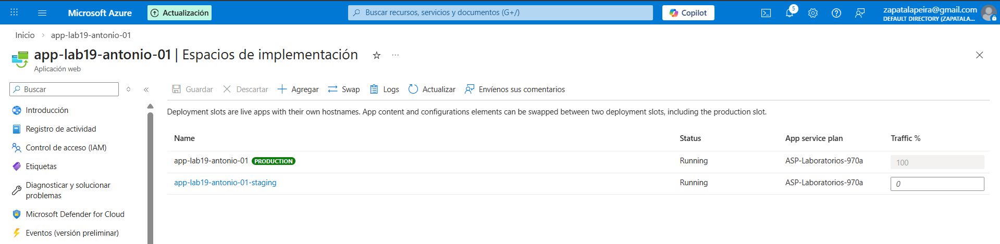

# Lab 30 – Incidencia: Rollback con Deployment Slots en App Service

## Objetivo
Simular un despliegue problemático y hacer rollback rápido usando slots (staging/production) y swap.

## Qué ha pasado (incidencia)
Se publica una versión nueva que falla. En vez de tocar producción “a mano”, se revierte haciendo swap al slot anterior.

## Resolución
He usado slots para intercambiar staging y production, validando que el sitio vuelve a funcionar tras el rollback.

## Evidencias

### 01 – Slots staging y production

### 02 – Swap ejecutado

### 03 – Web OK tras rollback

## Qué diría en entrevista
“Slots me permiten desplegar sin riesgo: pruebo en staging y hago swap cuando está OK. Si algo sale mal, el rollback es inmediato.”
